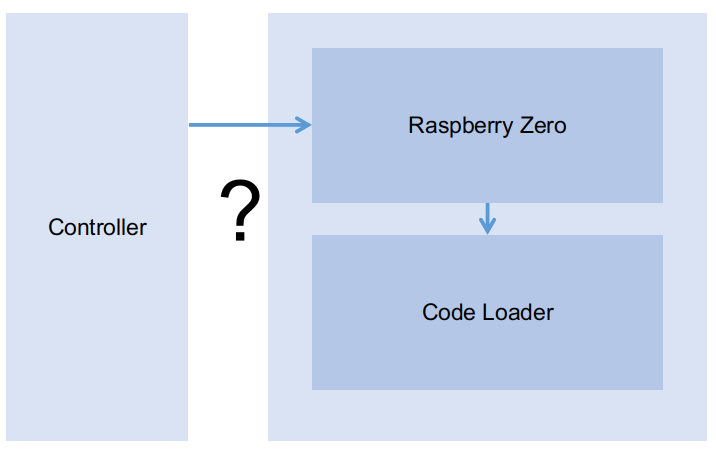
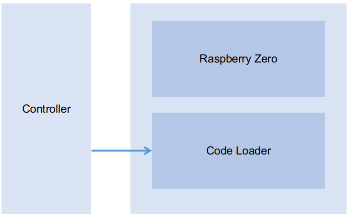
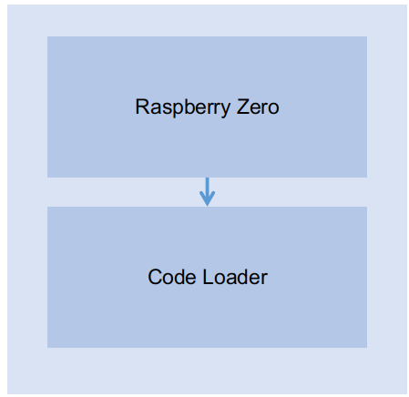
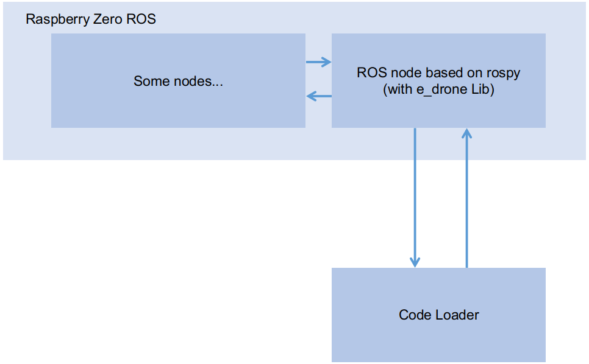

# Drone Interface


## 문제 상황

드론에는 코드로더인 아두이노보드가 있고, 위에 Raspberry zero 보드가 있다. 하지만, 통신이 어떻게 이루어지는지 알 수 없었고, 조종기가 라즈베리로, 라즈베리가 코드로더에 신호를 주는 것 처럼 보였다.




하지만, 교수님께서 라즈베리 위에있는 건 아무것도 아니라고 하셨다. 이게 무슨 의미였을까 생각해보았다.


## 조사 결과

하지만, 그게 아니었다. 현재, 드론은 라즈베리는 아무 역할도 하지 않고 있고, 조종기는 코드로더와 직접 통신하고 있다. 즉, 라즈베리는 우리가 직접 포맷하고 이용할 수 있는 보드이고, 라즈베리에서 코드로더에 신호를 줄 수 있다.




다시말해, 라즈베리에서 아두이노 IDE를 이용해서 CoDrone 라이브러리와 함께 코드를 코드로더에게 주입할 수 있고, 우리가 랩탑에서 조종기를 연결한 후에 신호를 전달했던 것과 똑같이 할 수 있다는 것이다.




그럼 문제는 간단해질 수 있다. 라즈베리보드에 "아두이노 라이브러리 + 코드론 라이브러리"를 설치한 후, 이들로 코드로더와 통신이 가능해진다. 파이썬의 경우, 라즈베리에 e-drone 라이브러리만으로도 통신이 가능하다.

따라서 코드 로더와 통신하는 부분은 다음과 같이 하면 될 듯 하다.




이때, 통신부위의 코드는 다음과 같이 하면 어떨까. (테스트 필요)

```python
from e_drone.drone import *
from e_drone.protocol import *

if __name__ == "__main__":
    drone = Drone()
    
    # 인자가 없으면, 라즈베리와 연결된 시리얼 포트중 가장 마지막 놈을 연결.
    # 라즈베리에는 코드 로더만 연결되어 있으므로 이놈과 연결된다.
    drone.open()
    
    #...
    drone.close()
```


이러면 교수님 말씀이 이해가 간다. 라즈베리 위에 있는 건 진짜 아무것도 아닌 것이다.